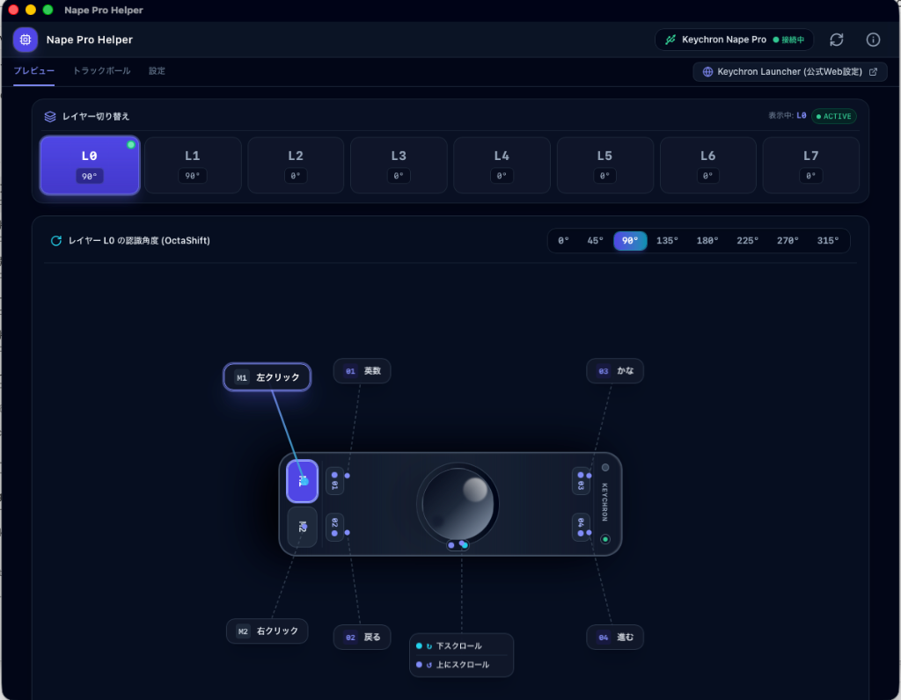
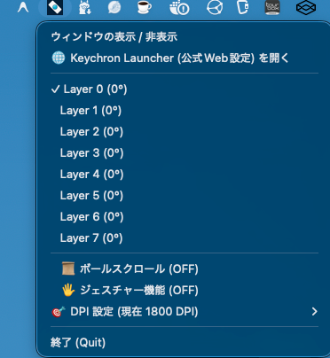
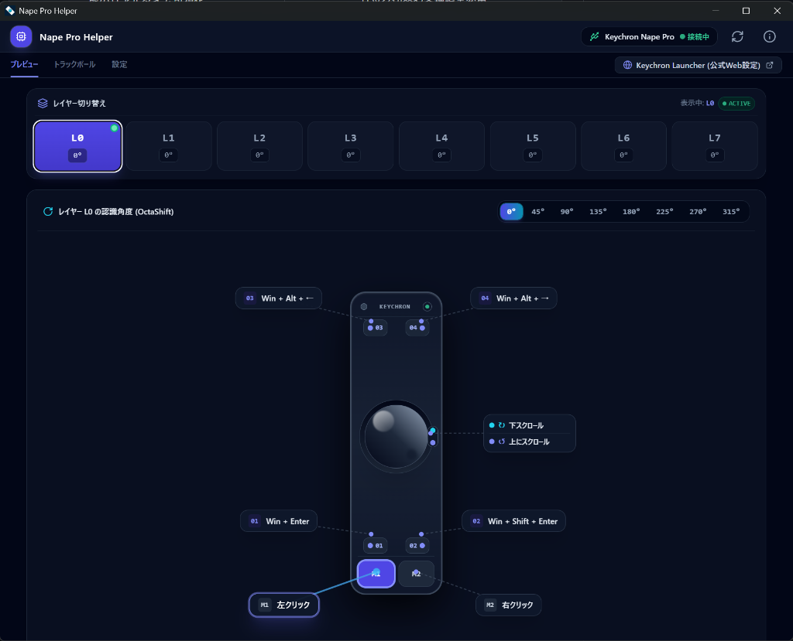
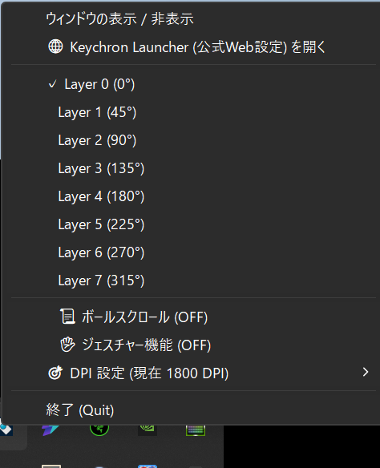

# NapePro Helper

<p align="center">
  
</p>

<p align="center">
  <b>System Tray Companion & Visualizer for Keychron Nape Pro Trackball Device</b>
</p>

<p align="center">
  <a href="https://github.com/blue1st/NapeProHelper/releases"></a>
  <a href="LICENSE"></a>
  
  
</p>

---

## 📖 概要 (Overview)

**NapePro Helper** は、トラックボールデバイス [Keychron Nape Pro](https://link.amazon/B0c0wPGJg) のためのシステムトレイ・ヘルパーアプリケーションです。

### 💡 開発の背景 (Motivation)

Keychron Nape Pro は、設置角度やキーマップを工夫することで様々なシーンに柔軟に対応できる魅力的なトラックボールであり、その高度なカスタマイズ性を活かすために 7 つもの豊富なレイヤー切り替え機能を備えています。

しかし、**現在適用されているレイヤーをハードウェア（本体）側で確認する手段がない**ため、積極的にレイヤーを切り替えて運用するのが難しいという課題がありました。

**NapePro Helper** は、アクティブなレイヤーやキーマップ状態を画面上・システムトレイでリアルタイムに可視化（Visualizer）し、アクティブアプリや接続PCに応じた**自動レイヤー切り替え**、設置角度に合わせた操作角度補正（**OctaShift**）などと合わせて、Nape Pro 本来の柔軟なマルチレイヤー運用を快適に行えるようにするために開発されました。

<details>
<summary><b>💡 Keychron Nape Pro のおすすめ活用シーン例（クリックで展開）</b></summary>

<br />

Keychron Nape Pro は、工夫次第で多様な作業環境に適用できます。

- **🔤 US（英字）配列キーボードへの「英数・かな」キー追加**  
  親指位置やサイドボタンの別レイヤーに「英数」「かな」キーを割り当て。US配列のスマートなデザインを維持したまま、JIS配列のようなワンタッチ日本語入力切り替えを実現。
- **🤖 バイブコーディング・AI開発の爆速化**  
  AIコーディングツールやIDEのコンテキスト送信、プロンプト呼出、ターミナル切り替え、Gitコマンドなどの複雑なショートカットキーをレイヤーごとに一括登録。画面上のリアルタイムVisualizerで迷わず爆速操作。
- **🎬 映像制作・動画編集の「左手デバイス」**  
  Premiere Pro、DaVinci Resolve、Final Cut Pro などのタイムライン移動、カット編集、ツール切り替え（選択・レーザー・マーカー等）を各レイヤーに割り当て。クリエイティブ作業の編集スピードと快適性を大幅向上。
- **💻 複数PC（Mac / Windows 等）間でのレイヤー自動使い分け**  
  接続するPCごとにデフォルトのベースレイヤーを設定しておくことで、切り替えても各OSや環境に合わせたキー配置へ自動適用。

</details>

---

## 📸 スクリーンショット (Screenshots)

### macOS

| メインウィンドウ (Visualizer & Settings) | メニューバー常駐 (System Tray Companion) |
| :---: | :---: |
|  |  |
| レイヤー切替、OctaShift 認識角度調整、キーマップ状態のリアルタイム可視化 | メニューバーからアクティブレイヤーの確認・ワンクリック切替や各種設定変更 |

### Windows

| メインウィンドウ (Visualizer & Settings) | タスクバー常駐 (System Tray Companion) |
| :---: | :---: |
|  |  |
| Windowsキーバインド・レイヤー・OctaShift認識角度のリアルタイム可視化 | タスクバー（システムトレイ）からアクティブレイヤーの確認・ワンクリック切替 |

---

## ✨ 主な機能 (Features)

- 🔄 **自動レイヤー切り替え (Auto Layer Switching)**  
  - **アプリに応じたキーマッピング使い分け**: アクティブ（最前面）なアプリケーション（IDE、動画編集、ブラウザ等）を自動検知し、各アプリ専用のレイヤーに瞬時に切り替え。
  - **接続PCに応じたデフォルトレイヤー切り替え**: PC（Mac/Windows、仕事用/個人用等）ごとにデフォルトレイヤーを指定可能。未指定アプリ使用時もそのPCに最適なベースレイヤーへ自動復帰。
- 🧭 **OctaShift 角度調整 (OctaShift Angle Tuning)**  
  デバイスの設置角度や手の角度に合わせて、レイヤーごとにトラックボールのカーソル移動角度（0°〜315° の8方向）をリアルタイムに調整・補正。
- ⚡ **DPI & トラックボール制御 (DPI & Trackball Control)**  
  ポインタ感度（DPI）の調整、トラックボールによるスクロールモード・ジェスチャーモードの切替。
- 🎨 **インタラクティブ・ライザー (Interactive Layer Visualizer)**  
  Keychron Nape Pro の接続状態、現在アクティブなレイヤー、キーバインディング、OctaShift 角度ガイドを直感的に視覚化。
- 🔔 **システムトレイ常駐 & 自動起動 (System Tray & Autostart)**  
  macOS メニューバー / Windows タスクバー（システムトレイ）からすばやく設定変更が可能。ログイン時の自動起動にも対応。

---

## 🔌 対応接続方式と仕様 (Supported Connection Modes)

NapePro Helper は、以下の接続方式に対応しています。

| 接続方式 | 動作サポート | 説明 |
| :--- | :---: | :--- |
| **USB 有線接続** | **✅ 対応** | 完全同期・リアルタイム制御対応。推奨接続環境です。 |
| **USB 2.4GHz ドングル（無線）** | **✅ 対応** | 付属の 2.4GHz USB レシーバー経由での完全同期に対応しています。 |
| **Bluetooth 接続** | **⚠️ 非対応** | Bluetooth 接続時は OS・ハードウェアの HID 仕様上、VIA Raw HID 通信（設定・キーマップ同期パケット）が無効化・遮断されるため、本アプリとの同期・設定変更ができません。<br />*(※Keychron 公式 Web 設定アプリ Keychron Launcher と同仕様となります)* |

> 💡 **注意事項**: 設定変更や自動レイヤー切り替えをご利用の際は、**USB 有線接続** または **2.4GHz USB ドングル（無線）** で PC に接続してください。

---

## 🚀 インストール方法 (Installation)

### 1. macOS

#### Homebrew Cask (推奨 / Recommended)

```bash
brew tap blue1st/taps
brew install --cask napepro-helper
```

#### 直接ダウンロード (Direct DMG Download)

[GitHub Releases](https://github.com/blue1st/NapeProHelper/releases) から最新の macOS 用インストーラー (`.dmg`) をダウンロードし、`Applications` フォルダにドラッグ＆ドロップしてください。

> 💡 **初回起動時の注意 (macOS)**: 未署名アプリケーションのメッセージが表示された場合は、副ボタン（右クリック）で「開く」を選択するか、`システム設定 > プライバシーとセキュリティ` から開くを許可してください。

### 2. Windows

#### 直接ダウンロード (Direct Installer Download)

[GitHub Releases](https://github.com/blue1st/NapeProHelper/releases) から最新の Windows 用インストーラー (`.exe` または `.msi`) をダウンロードし、実行してインストールしてください。

---

## 🛠️ 開発・ビルド手順 (Development & Build)

### 前提条件 (Prerequisites)

- Node.js 18.x 以上
- Rust (最新 stable)
- Xcode Command Line Tools (`xcode-select --install`)

### 開発環境の起動 (Run Development Server)

```bash
# 依存関係のインストール
npm install

# フロントエンド開発サーバーの起動 (Vite)
npm run dev

# Tauri アプリケーションとして起動
npm run tauri dev
```

### アプリケーションのビルド (Build Release Bundle)

```bash
# Webアセットのビルドおよび Tauri パッケージ作成 (macOS: .dmg / .app, Windows: .exe / .msi)
npm run build
npm run tauri build
```

---

## 📄 ライセンス (License)

[MIT License](LICENSE) © blue1st
